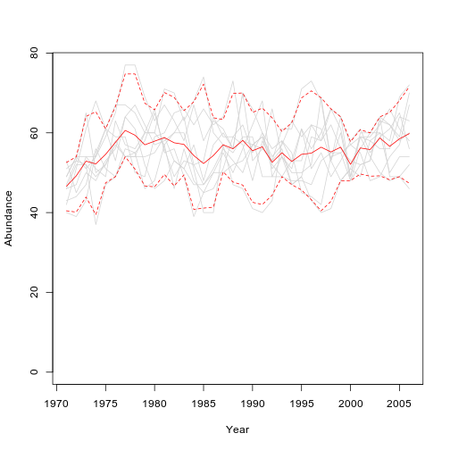
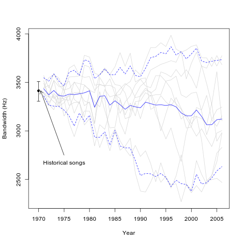
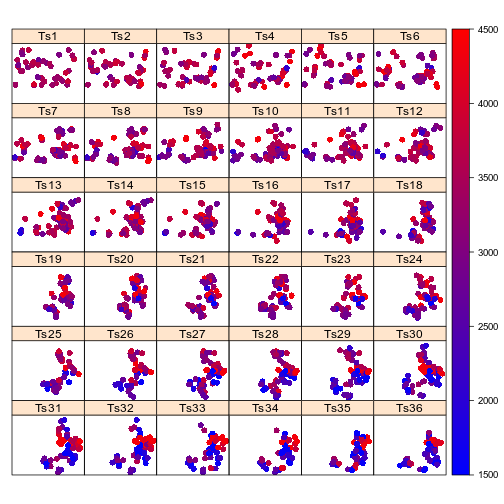
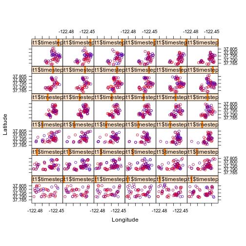
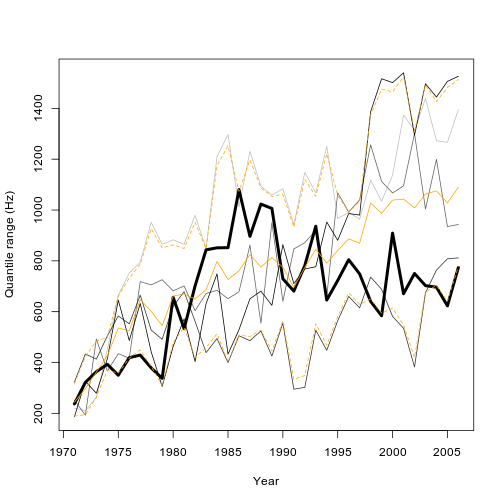
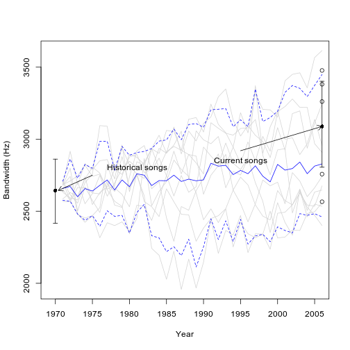

##Introduction

SongEvo simulates the cultural evolution of quantitative traits of bird song. SongEvo is an individual- (agent-) based model. SongEvo is spatially-explicit and can be parameterized with, and tested against, measured song data. Functions are available for model implementation, sensitivity analyses, parameter optimization, model validation, and hypothesis testing. 

### Overview of Functions  

1. `SongEvo` implements the model
1. `par.sens` allows sensitivity analyses
1. `par.opt` allows parameter optimization
1. `mod.val` allows model validation
1. `h.test` allows hypothesis testing

## Getting Started  
### Installing 'SongEvo' from GitHub

In order to install the vignette along with the package use the following code with `build_vignettes = TRUE`. 
**Note** it takes quite a bit longer to download the package when `build_vignettes = TRUE`.


```r
install.packages("devtools")
library(devtools)
devtools::install_github("raydanner/SongEvo", build_vignettes = TRUE)
library(SongEvo)
```


### Functions    

`SongEvo` implements the model
`par.sens` allows sensitivity analyses
`par.opt` allows parameter optimization
`mod.val` allows model validation
`h.test` allows hypothesis testing

## Examples

### EXAMPLE 1

### Load the example data: song.data
To explore the SongEvo package, we will use a database of songs from Nuttall’s white-crowned sparrow (*Zonotrichia leucophrys nuttalli*) recorded at three locations in 1969 and 2005. 

```r
data("song.data")
```

Examine global parameters.Global parameters describe our understanding of the system and may be measured or hypothesized. They are called "global" because they are used by many many functions and subroutines within functions. For descriptions of all adjustable parameters, see `?song.data` or Danner et al. (year)

```r
str(glo.parms)
#> List of 15
#>  $ learning.error.d  : num 0
#>  $ learning.error.sd : num 430
#>  $ n.territories     : num 40
#>  $ mortality.a       : num 0.468
#>  $ mortality.j       : num 0.5
#>  $ lifespan          : num 2.08
#>  $ phys.lim.min      : num 1559
#>  $ phys.lim.max      : num 4364
#>  $ male.fledge.n.mean: num 1.35
#>  $ male.fledge.n.sd  : num 0.5
#>  $ disp.age          : num 2
#>  $ disp.distance.mean: num 110
#>  $ disp.distance.sd  : num 100
#>  $ terr.turnover     : num 0.5
#>  $ male.fledge.n     : num [1:40] 1 1 2 1 0 2 2 2 2 1 ...
```
Share global parameters with the global environment. We make these parameters available in the global environment so that we can access them with minimal code.

```r
list2env(glo.parms, globalenv())
#> <environment: R_GlobalEnv>
```

#### Examine song data
Data include the population name (Bear Valley, PRBO, or Schooner), year of song recording (1969 or 2005), and the frequency bandwidth of the trill.

```r
str(song.data)
#> 'data.frame':	89 obs. of  3 variables:
#>  $ Population: Factor w/ 3 levels "Bear Valley",..: 3 3 3 3 3 3 3 3 3 3 ...
#>  $ Year      : int  1969 1969 1969 1969 1969 1969 1969 1969 1969 1969 ...
#>  $ Trill.FBW : num  3261 2494 2806 2878 2758 ...
```

### Simulate bird song evolution with `SongEvo()`

#### Define initial individuals
In this example, we use songs from individual birds recorded in one population (PRBO) in the year 1969, which we will call `starting.trait`.

```r
starting.trait <- subset(song.data, Population=="PRBO" & Year==1969)$Trill.FBW
```
We want a starting population of 40 individuals, so we generate additional trait values to complement those from the existing 30 individuals. Then we create a data frame that includes a row for each individual; we add identification numbers, ages, and geographical coordinates for each individual.  

```r
starting.trait2 <- c(starting.trait, rnorm(n.territories-length(starting.trait), mean=mean(starting.trait), sd=sd(starting.trait)))
init.inds <- data.frame(id = seq(1:n.territories), age = 2, trait = starting.trait2)
init.inds$x1 <-  round(runif(n.territories, min=-122.481858, max=-122.447270), digits=8)
init.inds$y1 <-  round(runif(n.territories, min=37.787768, max=37.805645), digits=8)
```

#### Specify and call the SongEvo model
`SongEvo()` includes several settings, which we specify before running the model. For this example, we run the model for 10 iterations, over 36 years (i.e. 1969--2005). When conducting research with `SongEvo()`, users will want to increase the number iterations (e.g. to 100 or 1000). Each timestep is one year in this model (i.e. individuals complete all components of the model in 1 year). We specify territory turnover rate here as an example of how to adjust parameter values.  We could adjust any other parameter value here also. The learning method specifies that individuals integrate songs heard from adults within the specified integration distance (intigrate.dist, in kilometers). In this example, we do not includ a lifespan, so we assign it NA. In this example, we do not model competition for mates, so specify it as FALSE. Last, specify all as TRUE in order to save data for every single simulated individual because we will use those data later for mapping. If we do not need data for each individual, we set all to FALSE because the all.inds data.frame becomes very large! 

```r
iteration <- 10
years <- 36
timestep <- 1
terr.turnover <- 0.5
learning.method <- "integrate"
integrate.dist <- 0.1
lifespan <- NA
mate.comp <- FALSE
prin <- FALSE
all <- TRUE
```
Now we call SongEvo with our specifications and save it in an object called SongEvo1.

```r
SongEvo1 <- SongEvo(init.inds = init.inds, iteration = iteration, steps = years,  timestep = timestep, n.territories = n.territories, terr.turnover = terr.turnover, learning.method = learning.method, integrate.dist = integrate.dist, learning.error.d = learning.error.d, learning.error.sd = learning.error.sd, mortality.a = mortality.a, mortality.j = mortality.j, lifespan = lifespan, phys.lim.min = phys.lim.min, phys.lim.max = phys.lim.max, male.fledge.n.mean = male.fledge.n.mean, male.fledge.n.sd = male.fledge.n.sd, male.fledge.n = male.fledge.n, disp.age = disp.age, disp.distance.mean = disp.distance.mean, disp.distance.sd = disp.distance.sd, mate.comp = mate.comp, prin = prin, all)
```

#### Examine results from SongEvo model
The model required the following time to run on your computer:

```r
SongEvo1$time
#>    user  system elapsed 
#>   1.554   0.001   1.554
```

Three main objects hold data regarding the SongEvo model.  Additional objects are used temporarily within modules of the model. 

First, currently alive individuals are stored in a data frame called “inds.”  Values within “inds” are updated throughout each of the iterations of the model, and “inds” can be viewed after the model is completed.

```r
head(SongEvo1$inds, 5)
#>                coordinates   id age    trait        x1       y1
#> 1631 (-122.4516, 37.80582) 1631   7 4025.953 -122.4516 37.80582
#> 1654 (-122.4465, 37.81119) 1654   7 3080.452 -122.4465 37.81119
#> 1691 (-122.4716, 37.79874) 1691   6 4029.544 -122.4716 37.79874
#> 1734 (-122.4468, 37.81209) 1734   5 3430.331 -122.4468 37.81209
#> 1739 (-122.4693, 37.80118) 1739   5 4335.153 -122.4693 37.80118
#>      male.fledglings territory father        x0       y0
#> 1631               0         0   1528 -122.4516 37.80578
#> 1654               2         1   1582 -122.4475 37.81019
#> 1691               0         0   1606 -122.4728 37.79945
#> 1734               1         1   1654 -122.4465 37.81119
#> 1739               1         1   1660 -122.4710 37.80042
```
Second, an array (i.e. a multi-dimensional table) entitled “summary.results” includes population summary values for each time step (dimension 1) in each iteration (dimension 2) of the model.  Population summary values are contained in five additional dimensions: population size for each time step of each iteration (“sample.n”), the population mean and variance of the song feature studied (“trait.pop.mean” and “trait.pop.variance”), with associated lower (“lci”) and upper (“uci”) confidence intervals.  

```r
dimnames(SongEvo1$summary.results)
#> $iteration
#>  [1] "iteration 1"  "iteration 2"  "iteration 3"  "iteration 4" 
#>  [5] "iteration 5"  "iteration 6"  "iteration 7"  "iteration 8" 
#>  [9] "iteration 9"  "iteration 10"
#> 
#> $step
#>  [1] "1"  "2"  "3"  "4"  "5"  "6"  "7"  "8"  "9"  "10" "11" "12" "13" "14"
#> [15] "15" "16" "17" "18" "19" "20" "21" "22" "23" "24" "25" "26" "27" "28"
#> [29] "29" "30" "31" "32" "33" "34" "35" "36"
#> 
#> $feature
#> [1] "sample.n"           "trait.pop.mean"     "trait.pop.variance"
#> [4] "lci"                "uci"
```
Third, individual values may optionally be concatenated and saved to one data frame entitled “all.inds.”  all.inds can become quite large, and is therefore only recommended if additional data analyses are desired. 

```r
head(SongEvo1$all.inds, 5)
#>                   coordinates id age  trait        x1       y1
#> I1.T1.1  (-122.471, 37.78994)  1   2 4004.8 -122.4710 37.78994
#> I1.T1.2 (-122.4478, 37.80139)  2   2 3765.0 -122.4478 37.80139
#> I1.T1.3 (-122.4517, 37.78971)  3   2 3237.4 -122.4517 37.78971
#> I1.T1.4 (-122.4685, 37.79883)  4   2 3621.1 -122.4685 37.79883
#> I1.T1.5  (-122.4613, 37.7982)  5   2 3285.4 -122.4613 37.79820
#>         male.fledglings territory father x0 y0 timestep iteration
#> I1.T1.1               1         1      0  0  0        1         1
#> I1.T1.2               1         1      0  0  0        1         1
#> I1.T1.3               2         1      0  0  0        1         1
#> I1.T1.4               1         1      0  0  0        1         1
#> I1.T1.5               0         1      0  0  0        1         1
```

#### Simulated population size
We see that the simulated population size remains relatively stable over the course of 36 years. This code uses the summary.results array.

```r
plot(SongEvo1$summary.results[1, , "sample.n"], xlab="Year", ylab="Abundance", type="n", xaxt="n", ylim=c(0, max(SongEvo1$summary.results[, , "sample.n"], na.rm=TRUE)))
axis(side=1, at=seq(0, 40, by=5), labels=seq(1970, 2010, by=5))
	for(p in 1:iteration){
		lines(SongEvo1$summary.results[p, , "sample.n"], col="light gray")
		}
n.mean <- apply(SongEvo1$summary.results[, , "sample.n"], 2, mean, na.rm=TRUE)
lines(n.mean, col="red")

#Plot 95% quantiles
quant.means <- apply (SongEvo1$summary.results[, , "sample.n"], MARGIN=2, quantile, probs=c(0.975, 0.025), R=600, na.rm=TRUE)
lines(quant.means[1,], col="red", lty=2)
lines(quant.means[2,], col="red", lty=2)
```



Load Hmisc package for plotting functions.

```r
library("Hmisc")
```

#### Simulated trait values
We see that the mean trait values per iteration varied widely, though mean trait values over all iterations remained relatively stable. This code uses the summary.results array.

```r
plot(SongEvo1$summary.results[1, , "trait.pop.mean"], xlab="Year", ylab="Bandwidth (Hz)", xaxt="n", type="n", xlim=c(-0.5, 36), ylim=c(min(SongEvo1$summary.results[, , "trait.pop.mean"], na.rm=TRUE), max(SongEvo1$summary.results[, , "trait.pop.mean"], na.rm=TRUE)))
	for(p in 1:iteration){
		lines(SongEvo1$summary.results[p, , "trait.pop.mean"], col="light gray")
		}
freq.mean <- apply(SongEvo1$summary.results[, , "trait.pop.mean"], 2, mean, na.rm=TRUE)
lines(freq.mean, col="blue")
axis(side=1, at=seq(0, 35, by=5), labels=seq(1970, 2005, by=5))#, tcl=-0.25, mgp=c(2,0.5,0))

#Plot 95% quantiles
quant.means <- apply (SongEvo1$summary.results[, , "trait.pop.mean"], MARGIN=2, quantile, probs=c(0.95, 0.05), R=600, na.rm=TRUE)
lines(quant.means[1,], col="blue", lty=2)
lines(quant.means[2,], col="blue", lty=2)

#plot mean and CI for historic songs.  
 #plot original song values
library("boot")
#> 
#> Attaching package: 'boot'
#> The following object is masked from 'package:survival':
#> 
#>     aml
#> The following object is masked from 'package:lattice':
#> 
#>     melanoma
sample.mean <- function(d, x) {
	mean(d[x])
}
boot_hist <- boot(starting.trait, statistic=sample.mean, R=100)#, strata=mn.res$iteration)	
ci.hist <- boot.ci(boot_hist, conf=0.95, type="basic")
low <- ci.hist$basic[4]
high <- ci.hist$basic[5]
points(0, mean(starting.trait), pch=20, cex=0.6, col="black")
errbar(x=0, y=mean(starting.trait), high, low, add=TRUE)
 #text and arrows
text(x=5, y=2720, labels="Historical songs", pos=1)
arrows(x0=5, y0=2750, x1=0.4, y1=mean(starting.trait), length=0.1)
```



#### Trait variance
We see that variance for each iteration per year increased in the first few years and then stabilized. This code uses the summary.results array.

```r
 #plot variance for each iteration per year
plot(SongEvo1$summary.results[1, , "trait.pop.variance"], xlab="Year", ylab="Bandwidth Variance (Hz)", type="n", xaxt="n", ylim=c(min(SongEvo1$summary.results[, , "trait.pop.variance"], na.rm=TRUE), max(SongEvo1$summary.results[, , "trait.pop.variance"], na.rm=TRUE)))
axis(side=1, at=seq(0, 40, by=5), labels=seq(1970, 2010, by=5))
	for(p in 1:iteration){
		lines(SongEvo1$summary.results[p, , "trait.pop.variance"], col="light gray")
		}
n.mean <- apply(SongEvo1$summary.results[, , "trait.pop.variance"], 2, mean, na.rm=TRUE)
lines(n.mean, col="green")

#Plot 95% quantiles
quant.means <- apply (SongEvo1$summary.results[, , "trait.pop.variance"], MARGIN=2, quantile, probs=c(0.975, 0.025), R=600, na.rm=TRUE)
lines(quant.means[1,], col="green", lty=2)
lines(quant.means[2,], col="green", lty=2)
```


#### Maps
The simulation results include geographical coordinates and are in a standard spatial data format, thus allowing calculation of a wide variety of spatial statistics. 

Load packages for making maps.

```r
library("sp")
library("reshape2")
library("lattice")
```

Convert data frame from long to wide format. This is necessary for making a multi-panel plot. 

```r
all.inds1 <- subset(SongEvo1$all.inds, iteration==1)
w <- dcast(as.data.frame(all.inds1), id ~ timestep, value.var="trait", fill=0)
all.inds1w <- merge(all.inds1, w, by="id")
names(all.inds1w) <- c(names(all.inds1), paste("Ts", seq(1:years), sep=""))
```

Create a function to generate a continuous color palette--we will use the palette in the next call to make color ramp to represent the trait value.

```r
rbPal <- colorRampPalette(c('blue','red')) #Create a function to generate a continuous color palette
```

Plot maps, including a separate panel for each timestep (each of 36 years). Our example shows that individuals move across the landscape and that regional dialects evolve and move. The x-axis is longitude, the y-axis is latitude, and the color ramp indicates trill bandwidth in Hz.

```r
spplot(all.inds1w[,-c(1:ncol(all.inds1))], as.table=TRUE, cuts=c(0, seq(from=1500, to=4500, by=10)), ylab="", col.regions=c("transparent", rbPal(1000)), #cuts specifies that the first level (e.g. <1500) is transparent.
colorkey=list(
	right=list(
		  fun=draw.colorkey,
		  args=list( 
		  		key=list(
		  		at=seq(1500, 4500, 10),
		  		col=rbPal(1000),
		  		labels=list(
		  		at=c(1500, 2000, 2500, 3000, 3500, 4000, 4500),
		  		labels=c("1500", "2000", "2500", "3000", "3500", "4000", "4500")
		  		)
		  		)
		  		)
		  	)
	)
)
```



In addition, you can plot simpler multi-panel maps that do not take advantage of the spatial data class.

```r
 #Lattice plot (not as a spatial frame)
it1 <- subset(SongEvo1$all.inds, iteration==1)
rbPal <- colorRampPalette(c('blue','red')) #Create a function to generate a continuous color palette
it1$Col <- rbPal(10)[as.numeric(cut(it1$trait, breaks = 10))]
xyplot(it1$y1~it1$x1 | it1$timestep, groups=it1$trait, asp="iso", col=it1$Col, xlab="Longitude", ylab="Latitude")
```



### Test model sensitivity with `par.sens()`
This function allows testing the sensitivity of SongEvo to different parameter values. 

#### Specify and call `par.sens()`
Here we test the sensitivity of the Acquire a Territory submodel to variation in territory turnover rates, ranging from 0.8–1.2 times the published rate (40–60% of territories turned over). The call for the par.sens function has a format similar to SongEvo. The user specifies the parameter to test and the range of values for that parameter. The function currently allows examination of only one parameter at a time and requires at least two iterations.

```r
parm <- "terr.turnover"
par.range = seq(from=0.4, to=0.6, by=0.05)
sens.results <- NULL
```

Now we call the par.sens function with our specifications.

```r
extra_parms <- list(init.inds = init.inds, 
                    timestep = 1, 
                    n.territories = nrow(init.inds), 
                    learning.method = "integrate", 
                    integrate.dist = 0.1, 
                    lifespan = NA, 
                    terr.turnover = 0.5, 
                    mate.comp = FALSE, 
                    prin = FALSE,
                    all = TRUE)
global_parms_key <- which(!names(glo.parms) %in% names(extra_parms))
extra_parms[names(glo.parms[global_parms_key])]=glo.parms[global_parms_key]
par.sens1 <- par.sens(parm = parm, par.range = par.range, 
                      iteration = iteration, steps = years, mate.comp = FALSE, 
                      fixed_parms=extra_parms[names(extra_parms)!=parm], all = TRUE)
#> [1] "terr.turnover =  0.4"
#> [1] "terr.turnover =  0.45"
#> [1] "terr.turnover =  0.5"
#> [1] "terr.turnover =  0.55"
#> [1] "terr.turnover =  0.6"
```

#### Examine par.sens results
Examine results objects, which include two arrays: 

The first array, `sens.results`, contains the SongEvo model results for each parameter. It has the following dimensions:

```r
dimnames(par.sens1$sens.results)
#> [[1]]
#>  [1] "iteration 1"  "iteration 2"  "iteration 3"  "iteration 4" 
#>  [5] "iteration 5"  "iteration 6"  "iteration 7"  "iteration 8" 
#>  [9] "iteration 9"  "iteration 10"
#> 
#> [[2]]
#>  [1] "1"  "2"  "3"  "4"  "5"  "6"  "7"  "8"  "9"  "10" "11" "12" "13" "14"
#> [15] "15" "16" "17" "18" "19" "20" "21" "22" "23" "24" "25" "26" "27" "28"
#> [29] "29" "30" "31" "32" "33" "34" "35" "36"
#> 
#> [[3]]
#> [1] "sample.n"           "trait.pop.mean"     "trait.pop.variance"
#> [4] "lci"                "uci"               
#> 
#> [[4]]
#> [1] "par.val 0.4"  "par.val 0.45" "par.val 0.5"  "par.val 0.55"
#> [5] "par.val 0.6"
```
The second array, `sens.results.diff` contains the quantile range of trait values across iterations within a parameter value. It has the following dimensions:

```r
dimnames(par.sens1$sens.results.diff)
#> [[1]]
#> [1] "par.val 0.4"  "par.val 0.45" "par.val 0.5"  "par.val 0.55"
#> [5] "par.val 0.6" 
#> 
#> [[2]]
#>  [1] "Quantile diff 1"  "Quantile diff 2"  "Quantile diff 3" 
#>  [4] "Quantile diff 4"  "Quantile diff 5"  "Quantile diff 6" 
#>  [7] "Quantile diff 7"  "Quantile diff 8"  "Quantile diff 9" 
#> [10] "Quantile diff 10" "Quantile diff 11" "Quantile diff 12"
#> [13] "Quantile diff 13" "Quantile diff 14" "Quantile diff 15"
#> [16] "Quantile diff 16" "Quantile diff 17" "Quantile diff 18"
#> [19] "Quantile diff 19" "Quantile diff 20" "Quantile diff 21"
#> [22] "Quantile diff 22" "Quantile diff 23" "Quantile diff 24"
#> [25] "Quantile diff 25" "Quantile diff 26" "Quantile diff 27"
#> [28] "Quantile diff 28" "Quantile diff 29" "Quantile diff 30"
#> [31] "Quantile diff 31" "Quantile diff 32" "Quantile diff 33"
#> [34] "Quantile diff 34" "Quantile diff 35" "Quantile diff 36"
```

To assess sensitivity of SongEvo to a range of parameter values, plot the range in trait quantiles per year by the parameter value. We see that territory turnover values of 0.4--0.6 provided means and quantile ranges of trill bandwidths that are similar to those obtained with the published estimate of 0.5, indicating that the Acquire a Territory submodel is robust to realistic variation in those parameter values.

In the figure, solid gray and black lines show the quantile range of song frequency per year over all iterations as parameterized with the published territory turnover rate (0.5; thick black line) and a range of values from 0.4 to 0.6 (in steps of 0.05, light to dark gray). Orange lines show the mean and 2.5th and 97.5th quantiles of all quantile ranges.

```r
 #plot of range in trait quantiles by year by parameter value
plot(1:years, par.sens1$sens.results.diff[1,], ylim=c(min(par.sens1$sens.results.diff, na.rm=TRUE), max(par.sens1$sens.results.diff, na.rm=TRUE)), type="l", ylab="Quantile range (Hz)", xlab="Year", col="transparent", xaxt="n")
axis(side=1, at=seq(0, 35, by=5), labels=seq(1970, 2005, by=5))

  #Make a continuous color ramp from gray to black
grbkPal <- colorRampPalette(c('gray','black'))
  
  #Plot a line for each parameter value
for(i in 1:length(par.range)){
lines(1:years, par.sens1$sens.results.diff[i,], type="l", col=grbkPal(length(par.range))[i])
}

  #Plot values from published parameter values
lines(1:years, par.sens1$sens.results.diff[2,], type="l", col="black", lwd=4)

  #Calculate and plot mean and quantiles
quant.mean <- apply(par.sens1$sens.results.diff, 2, mean, na.rm=TRUE)
lines(quant.mean, col="orange")

#Plot 95% quantiles (which are similar to credible intervals)
  #95% quantiles of population means (narrower)
quant.means <- apply (par.sens1$sens.results.diff, MARGIN=2, quantile, probs=c(0.975, 0.025), R=600, na.rm=TRUE)
lines(quant.means[1,], col="orange", lty=2)
lines(quant.means[2,], col="orange", lty=2)
```



### Optimize parameter values with `par.opt()`
This function follows par.sens to help users optimize values for imperfectly known parameters for SongEvo. The goals are to maximize accuracy and precision of model prediction. Accuracy is quantified by three different approaches: i) the mean of absolute residuals of the predicted population mean values in relation to target data (e.g. observed or hypothetical values (smaller absolute residuals indicate a more accurate model)), ii) the difference between the bootstrapped mean of predicted population means and the mean of the target data, and iii) the proportion of simulated population trait means that fall within (i.e. are "contained by") the confidence intervals of the target data (a higher proportion indicates greater accuracy). Precision is measured with the residuals of the predicted population variance to the variance of target data (smaller residuals indicate a more precise model). 

#### Prepare current song values

```r
target.data <- subset(song.data, Population=="PRBO" & Year==2005)$Trill.FBW
```

#### Specify and call `par.opt()`
Users specify the timestep (“ts”) at which to compare simulated trait values to target trait data (“target.data”) and save the results in an object (called `par.opt1` here).

```r
ts <- years
par.opt1 <- par.opt(sens.results=par.sens1$sens.results, ts=ts, target.data=target.data, par.range=par.range)
```

Examine results objects (residuals and target match).  

```r
par.opt1$Residuals
#> , , Residuals of mean
#> 
#>              Iteration 1 Iteration 2 Iteration 3 Iteration 4 Iteration 5
#> par.val 0.4     566.8049    498.8806    92.31472   184.93993    57.64082
#> par.val 0.45    114.1826    280.5501   399.60298   141.35268   548.11027
#> par.val 0.5     450.8103    132.4566   175.12657   354.33671   478.07387
#> par.val 0.55    265.1567    654.0224   205.69277    88.90299   273.61941
#> par.val 0.6     312.7031    893.1379   453.88448   813.76789   765.79124
#>              Iteration 6 Iteration 7 Iteration 8 Iteration 9 Iteration 10
#> par.val 0.4     27.03269   772.10338   1000.8744    36.47497    412.67315
#> par.val 0.45    61.42193   234.82855    324.7116   296.51186    253.54418
#> par.val 0.5    436.85798   307.58584    510.2873    36.60590     17.15896
#> par.val 0.55   378.47431    12.14172    148.2834   276.59656    164.45801
#> par.val 0.6    646.15190   136.25319    844.8089   146.78192    483.15782
#> 
#> , , Residuals of variance
#> 
#>              Iteration 1 Iteration 2 Iteration 3 Iteration 4 Iteration 5
#> par.val 0.4     357250.7    599862.1    755051.7    350311.3    595066.6
#> par.val 0.45    516078.1    442160.3    600920.3    454802.4    276900.8
#> par.val 0.5     681654.2    407848.9    140855.8    701002.8    553303.0
#> par.val 0.55    785385.1    296638.6    520154.6    609767.9    528610.5
#> par.val 0.6     337918.8    357935.8    534944.2    838056.5    292548.6
#>              Iteration 6 Iteration 7 Iteration 8 Iteration 9 Iteration 10
#> par.val 0.4     453767.6    544111.3   247724.14    352217.2     284486.0
#> par.val 0.45   1042715.2    395061.6   505530.10    420259.1     427354.3
#> par.val 0.5     509177.9    416311.4   243526.00    420331.7     473451.7
#> par.val 0.55    441165.9    571015.9  1001829.96    123957.1     735111.5
#> par.val 0.6     411500.1    978495.1    89109.37    474330.3     661030.8
par.opt1$Target.match
#>              Difference in means Proportion contained
#> par.val 0.4            126.68383                  0.3
#> par.val 0.45            74.59428                  0.1
#> par.val 0.5             33.28583                  0.2
#> par.val 0.55            55.46035                  0.2
#> par.val 0.6            227.36453                  0.0
```

#### Plot results of `par.opt()`
#### Accuracy

  1. Difference in means.

```r
plot(par.range, par.opt1$Target.match[,1], type="l", xlab="Parameter range", ylab="Difference in means (Hz)")
```

 difference in means-1.png)

  2. Plot proportion contained.

```r
plot(par.range, par.opt1$Prop.contained, type="l", xlab="Parameter range", ylab="Proportion contained")
```

 proportion contained-1.png)

  3. Calculate and plot mean and quantiles of residuals of mean trait values.

```r
res.mean.means <- apply(par.opt1$Residuals[, , 1], MARGIN=1, mean, na.rm=TRUE)
res.mean.quants <- apply (par.opt1$Residuals[, , 1], MARGIN=1, quantile, probs=c(0.975, 0.025), R=600, na.rm=TRUE)
plot(par.range, res.mean.means, col="orange", ylim=c(min(par.opt1$Residuals[,,1], na.rm=TRUE), max(par.opt1$Residuals[,,1], na.rm=TRUE)), type="b", xlab="Parameter value (territory turnover rate)", ylab="Residual of trait mean (trill bandwidth, Hz)")
points(par.range, res.mean.quants[1,], col="orange")
points(par.range, res.mean.quants[2,], col="orange")
lines(par.range, res.mean.quants[1,], col="orange", lty=2)
lines(par.range, res.mean.quants[2,], col="orange", lty=2)
```

 residuals of the mean-1.png)

#### Precision

```r
#Calculate and plot mean and quantiles of residuals of variance of trait values
res.var.mean <- apply(par.opt1$Residuals[, , 2], MARGIN=1, mean, na.rm=TRUE)
res.var.quants <- apply (par.opt1$Residuals[, , 2], MARGIN=1, quantile, probs=c(0.975, 0.025), R=600, na.rm=TRUE)
plot(par.range, res.var.mean, col="purple", ylim=c(min(par.opt1$Residuals[,,2], na.rm=TRUE), max(par.opt1$Residuals[,,2], na.rm=TRUE)), type="b", xlab="Parameter value (territory turnover rate)", ylab="Residual of trait variance (trill bandwidth, Hz)")
points(par.range, res.var.quants[1,], col="purple")
points(par.range, res.var.quants[2,], col="purple")
lines(par.range, res.var.quants[1,], col="purple", lty=2)
lines(par.range, res.var.quants[2,], col="purple", lty=2)
```

 residuals of the variance-1.png)

#### Visual inspection of accuracy and precision: plot trait values for range of parameters

```r
par(mfcol=c(3,2))
par(mar=c(4.1, 4.1, 1, 1))
par(cex=1.2)
for(i in 1:length(par.range)){
plot(par.sens1$sens.results[ , , "trait.pop.mean", ], xlab="Year", ylab="Bandwidth (Hz)", xaxt="n", type="n", xlim=c(-0.5, years), ylim=c(min(par.sens1$sens.results[ , , "trait.pop.mean", ], na.rm=TRUE), max(par.sens1$sens.results[ , , "trait.pop.mean", ], na.rm=TRUE)))
	for(p in 1:iteration){
		lines(par.sens1$sens.results[p, , "trait.pop.mean", i], col="light gray")
		}
freq.mean <- apply(par.sens1$sens.results[, , "trait.pop.mean", i], 2, mean, na.rm=TRUE)
lines(freq.mean, col="blue")
axis(side=1, at=seq(0, 35, by=5), labels=seq(1970, 2005, by=5))#, tcl=-0.25, mgp=c(2,0.5,0))

#Plot 95% quantiles
quant.means <- apply (par.sens1$sens.results[, , "trait.pop.mean", i], MARGIN=2, quantile, probs=c(0.95, 0.05), R=600, na.rm=TRUE)
lines(quant.means[1,], col="blue", lty=2)
lines(quant.means[2,], col="blue", lty=2)

#plot mean and CI for historic songs.  
 #plot original song values
library("boot")
sample.mean <- function(d, x) {
	mean(d[x])
}
boot_hist <- boot(starting.trait, statistic=sample.mean, R=100)#, strata=mn.res$iteration)	
ci.hist <- boot.ci(boot_hist, conf=0.95, type="basic")
low <- ci.hist$basic[4]
high <- ci.hist$basic[5]
points(0, mean(starting.trait), pch=20, cex=0.6, col="black")
library("Hmisc")
errbar(x=0, y=mean(starting.trait), high, low, add=TRUE)
 
 #plot current song values
library("boot")
sample.mean <- function(d, x) {
	mean(d[x])
}
boot_curr <- boot(target.data, statistic=sample.mean, R=100)#, strata=mn.res$iteration)	
ci.curr <- boot.ci(boot_curr, conf=0.95, type="basic")
low <- ci.curr$basic[4]
high <- ci.curr$basic[5]
points(years, mean(target.data), pch=20, cex=0.6, col="black")
library("Hmisc")
errbar(x=years, y=mean(target.data), high, low, add=TRUE)

  #plot panel title
text(x=3, y=max(par.sens1$sens.results[ , , "trait.pop.mean", ], na.rm=TRUE)-100, labels=paste("Par = ", par.range[i], sep=""))  
}
```

 visual inspection of simulated data-1.png)

### Model validation with `mod.val()`
This function allows users to assess the validity of the specified model by testing model performance with a population different from the population used to build the model. The user first runs SongEvo with initial trait values from the validation population. `mod.val()` uses the summary.results array from SongEvo, along with target values from a specified timestep, to calculate the same three measures of accuracy and one measure of precision that are calculated in par.opt. 

We parameterized SongEvo with initial song data from Schooner Bay, CA in 1969, and then compared simulated data to target (i.e. observed) data in 2005.

Prepare initial song data for Schooner Bay.

```r
starting.trait <- subset(song.data, Population=="Schooner" & Year==1969)$Trill.FBW
starting.trait2 <- c(starting.trait, rnorm(n.territories-length(starting.trait), mean=mean(starting.trait), sd=sd(starting.trait)))

init.inds <- data.frame(id = seq(1:n.territories), age = 2, trait = starting.trait2)
init.inds$x1 <-  round(runif(n.territories, min=-122.481858, max=-122.447270), digits=8)
init.inds$y1 <-  round(runif(n.territories, min=37.787768, max=37.805645), digits=8)
```

Specify and call SongEvo() with validation data

```r
iteration <- 10
years <- 36
timestep <- 1
terr.turnover <- 0.5

SongEvo2 <- SongEvo(init.inds = init.inds, iteration = iteration, steps = years,  timestep = timestep, n.territories = n.territories, terr.turnover = terr.turnover, learning.method = learning.method, integrate.dist = integrate.dist, learning.error.d = learning.error.d, learning.error.sd = learning.error.sd, mortality.a = mortality.a, mortality.j = mortality.j, lifespan = lifespan, phys.lim.min = phys.lim.min, phys.lim.max = phys.lim.max, male.fledge.n.mean = male.fledge.n.mean, male.fledge.n.sd = male.fledge.n.sd, male.fledge.n = male.fledge.n, disp.age = disp.age, disp.distance.mean = disp.distance.mean, disp.distance.sd = disp.distance.sd, mate.comp = mate.comp, prin = prin, all)
```

Specify and call mod.val

```r
ts <- 36
target.data <- subset(song.data, Population=="Schooner" & Year==2005)$Trill.FBW
mod.val1 <- mod.val(summary.results=SongEvo2$summary.results, ts=ts, target.data=target.data)
```

Plot results from `mod.val()`

```r
plot(SongEvo2$summary.results[1, , "trait.pop.mean"], xlab="Year", ylab="Bandwidth (Hz)", xaxt="n", type="n", xlim=c(-0.5, 36.5), ylim=c(min(SongEvo2$summary.results[, , "trait.pop.mean"], na.rm=TRUE), max(SongEvo2$summary.results[, , "trait.pop.mean"], na.rm=TRUE)))
	for(p in 1:iteration){
		lines(SongEvo2$summary.results[p, , "trait.pop.mean"], col="light gray")
		}
freq.mean <- apply(SongEvo2$summary.results[, , "trait.pop.mean"], 2, mean, na.rm=TRUE)
lines(freq.mean, col="blue")
axis(side=1, at=seq(0, 35, by=5), labels=seq(1970, 2005, by=5))#, tcl=-0.25, mgp=c(2,0.5,0))

#Plot 95% quantiles 
quant.means <- apply (SongEvo2$summary.results[, , "trait.pop.mean"], MARGIN=2, quantile, probs=c(0.95, 0.05), R=600, na.rm=TRUE)
lines(quant.means[1,], col="blue", lty=2)
lines(quant.means[2,], col="blue", lty=2)

#plot mean and CI for historic songs.  
 #plot original song values
library("boot")
sample.mean <- function(d, x) {
	mean(d[x])
}
boot_hist <- boot(starting.trait, statistic=sample.mean, R=100)
ci.hist <- boot.ci(boot_hist, conf=0.95, type="basic")
low <- ci.hist$basic[4]
high <- ci.hist$basic[5]
points(0, mean(starting.trait), pch=20, cex=0.6, col="black")
library("Hmisc")
errbar(x=0, y=mean(starting.trait), high, low, add=TRUE)

 #text and arrows
text(x=5, y=2720, labels="Historical songs", pos=1)
arrows(x0=5, y0=2750, x1=0.4, y1=mean(starting.trait), length=0.1)

 #plot current song values
library("boot")
sample.mean <- function(d, x) {
	mean(d[x])
}
boot_curr <- boot(target.data, statistic=sample.mean, R=100)
ci.curr <- boot.ci(boot_curr, conf=0.95, type="basic")
low <- ci.curr$basic[4]
high <- ci.curr$basic[5]
points(years, mean(target.data), pch=20, cex=0.6, col="black")
library("Hmisc")
errbar(x=years, y=mean(target.data), high, low, add=TRUE)

 #text and arrows
text(x=25, y=3100, labels="Current songs", pos=3)
arrows(x0=25, y0=3300, x1=36, y1=mean(target.data), length=0.1)
```

-1.png)

The model did reasonably well predicting trait evolution in the validation population, suggesting that it is valid for our purposes: the mean bandwidth was `abs(mean(target.data)-freq.mean)`Hz from the observed values, ~21% of predicted population means fell within the 95% confidence intervals of the observed data, and residuals of means (~545 Hz) and variances (~415181 Hz) were similar to those produced by the training data set.

### Hypothesis testing with `h.test()`
This function allows hypothesis testing with SongEvo.  To test if measured songs from two time points evolved through mechanisms described in the model (e.g. drift or selection), users initialize the model with historical data, parameterize the model based on their understanding of the mechanisms, and test if subsequently observed or predicted data match the simulated data. The output data list includes two measures of accuracy: the proportion of observed points that fall within the confidence intervals of the simulated data and the residuals between simulated and observed population trait means. Precision is measured as the residuals between simulated and observed population trait variances. We tested the hypothesis that songs of *Z. l. nuttalli* in Bear Valley, CA evolved through cultural drift from 1969 to 2005. 

Prepare initial song data for Bear Valley.

```r
starting.trait <- subset(song.data, Population=="Bear Valley" & Year==1969)$Trill.FBW
starting.trait2 <- c(starting.trait, rnorm(n.territories-length(starting.trait), mean=mean(starting.trait), sd=sd(starting.trait)))

init.inds <- data.frame(id = seq(1:n.territories), age = 2, trait = starting.trait2)
init.inds$x1 <-  round(runif(n.territories, min=-122.481858, max=-122.447270), digits=8)
init.inds$y1 <-  round(runif(n.territories, min=37.787768, max=37.805645), digits=8)
```

Specify and call SongEvo() with test data

```r
SongEvo3 <- SongEvo(init.inds = init.inds, iteration = iteration, steps = years,  timestep = timestep, n.territories = n.territories, terr.turnover = terr.turnover, learning.method = learning.method, integrate.dist = integrate.dist, learning.error.d = learning.error.d, learning.error.sd = learning.error.sd, mortality.a = mortality.a, mortality.j = mortality.j, lifespan = lifespan, phys.lim.min = phys.lim.min, phys.lim.max = phys.lim.max, male.fledge.n.mean = male.fledge.n.mean, male.fledge.n.sd = male.fledge.n.sd, male.fledge.n = male.fledge.n, disp.age = disp.age, disp.distance.mean = disp.distance.mean, disp.distance.sd = disp.distance.sd, mate.comp = mate.comp, prin = prin, all)
```

Specify and call `h.test()`

```r
target.data <- subset(song.data, Population=="Bear Valley" & Year==2005)$Trill.FBW
h.test1 <- h.test(summary.results=SongEvo3$summary.results, ts=ts, target.data=target.data)
```

The output data list includes two measures of accuracy: the proportion of observed points that fall within the confidence intervals of the simulated data and the residuals between simulated and observed population trait means. Precision is measured as the residuals between simulated and observed population trait variances.

Eighty percent of the observed data fell within the central 95% of the simulated values, providing support for the hypothesis that cultural drift as described in this model is sufficient to describe the evolution of trill frequency bandwidth in this population.

```r
h.test1
#> $Residuals
#>              Residuals of mean Residuals of variance
#> Iteration 1           554.3382              267267.1
#> Iteration 2           441.6775              457104.5
#> Iteration 3           529.8450              211152.4
#> Iteration 4           526.5411              312561.2
#> Iteration 5           180.8107              292401.0
#> Iteration 6           130.9225              307849.7
#> Iteration 7           346.7618              423955.0
#> Iteration 8           412.8869              193507.2
#> Iteration 9           688.3263              242883.3
#> Iteration 10          156.8656              234922.4
#> 
#> $Prop.contained
#> [1] 0.8
```

We can plot simulated data in relation to measured data.

```r
#Plot
plot(SongEvo3$summary.results[1, , "trait.pop.mean"], xlab="Year", ylab="Bandwidth (Hz)", xaxt="n", type="n", xlim=c(-0.5, 35.5), ylim=c(min(SongEvo3$summary.results[, , "trait.pop.mean"], na.rm=TRUE), max(SongEvo3$summary.results[, , "trait.pop.mean"], na.rm=TRUE)))
	for(p in 1:iteration){
		lines(SongEvo3$summary.results[p, , "trait.pop.mean"], col="light gray")
		}
freq.mean <- apply(SongEvo3$summary.results[, , "trait.pop.mean"], 2, mean, na.rm=TRUE)
lines(freq.mean, col="blue")
axis(side=1, at=seq(0, 35, by=5), labels=seq(1970, 2005, by=5))#, tcl=-0.25, mgp=c(2,0.5,0))

#Plot 95% quantiles (which are similar to credible intervals)
quant.means <- apply (SongEvo3$summary.results[, , "trait.pop.mean"], MARGIN=2, quantile, probs=c(0.95, 0.05), R=600, na.rm=TRUE)
lines(quant.means[1,], col="blue", lty=2)
lines(quant.means[2,], col="blue", lty=2)

 #plot original song values
library("boot")
sample.mean <- function(d, x) {
	mean(d[x])
}
boot_hist <- boot(starting.trait, statistic=sample.mean, R=100)#, strata=mn.res$iteration)	
ci.hist <- boot.ci(boot_hist, conf=0.95, type="basic")
low <- ci.hist$basic[4]
high <- ci.hist$basic[5]
points(0, mean(starting.trait), pch=20, cex=0.6, col="black")
library("Hmisc")
errbar(x=0, y=mean(starting.trait), high, low, add=TRUE)

 #plot current song values
points(rep(ts, length(target.data)), target.data)

library("boot")
sample.mean <- function(d, x) {
	mean(d[x])
}
boot_curr <- boot(target.data, statistic=sample.mean, R=100)#, strata=mn.res$iteration)	
ci.curr <- boot.ci(boot_curr, conf=0.95, type="basic")
low <- ci.curr$basic[4]
high <- ci.curr$basic[5]
points(years, mean(target.data), pch=20, cex=0.6, col="black")
library("Hmisc")
errbar(x=years, y=mean(target.data), high, low, add=TRUE)

 #text and arrows
text(x=11, y=2850, labels="Historical songs", pos=1)
arrows(x0=5, y0=2750, x1=0.4, y1=mean(starting.trait), length=0.1)
text(x=25, y=2900, labels="Current songs", pos=1)
arrows(x0=25, y0=2920, x1=years, y1=mean(target.data), length=0.1)
```


